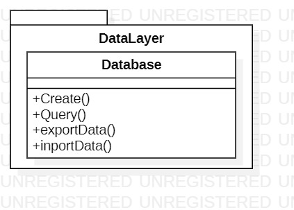
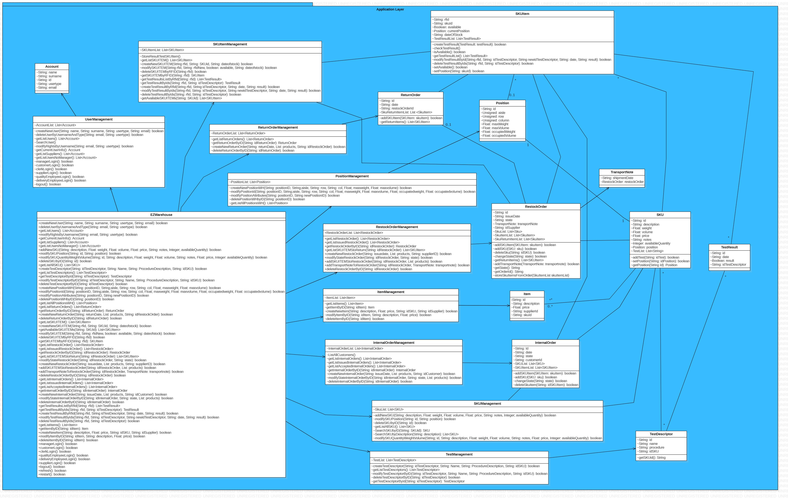
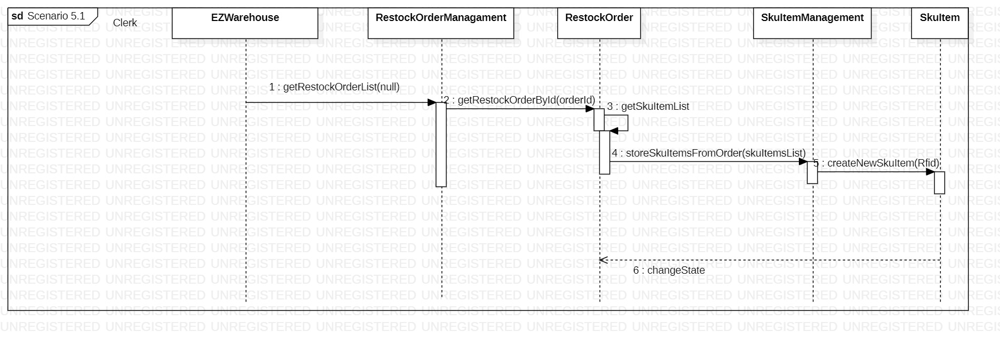
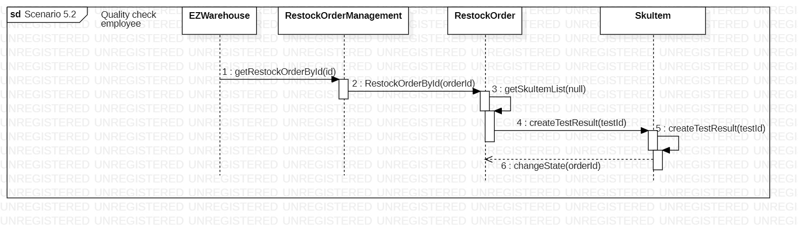

# Design Document 

Authors: 

Date: 27 April 2022

Version: 1.1

# Contents

- [Design Document](#design-document)
- [Contents](#contents)
- [Instructions](#instructions)
- [High level design](#high-level-design)
- [Low level design](#low-level-design)
- [Verification traceability matrix](#verification-traceability-matrix)
- [Verification sequence diagrams](#verification-sequence-diagrams)

# Instructions

The design must satisfy the Official Requirements document, notably functional and non functional requirements, and be consistent with the APIs

# High level design 

For what concern high level desgìign we used the 3 tier architecture. We focused our attention on the Application and data layers since the frontend is provided to us.

# Low level design

For the low level design we used a facade class (EzWarehouse) which is the point of interaction between frontend and backend. After that we consider different management classes that implements and solve the API requests using other classes that represents the different tables of the database.

# Verification traceability matrix

||EZWarehouse| UserManagement | PositionManagement | SKUItemManagement  | ReturnOrderManagement | RestockOrderManagement | ItemManagement | InternalOrderManagement | SKUManagement | TestManagement | Account | Position | ReturnOrder | RestockOrder | SKUItem  | TransportNote | Item | InternalOrder | SKU | TestDescriptor | TestResult |
| --- |:---|:---|:---|:---|:---|:---|:---|:---|:---|:---|:---|:---|:---|:---|:---|:---|:---|:---|:---|:---|:---|:---|:---|:---|:---|:---|:---|
|FR1     |X|X| | | | | | | | |X| | | | | | | | | | |
|FR1.1   |X|X| | | | | | | | |X| | | | | | | | | | |
|FR1.2   |X|X| | | | | | | | |X| | | | | | | | | | |
|FR1.3   |X|X| | | | | | | | |X| | | | | | | | | | |
|FR1.4   |X|X| | | | | | | | |X| | | | | | | | | | |
|FR1.5   |X|X| | | | | | | | |X| | | | | | | | | | |
|FR2     |X| | | | | | | |X| |X| | | | | | | |X| | | 
|FR2.1   |X| | | | | | | |X| |X| | | | | | | |X| | | 
|FR2.2   |X| | | | | | | |X| |X| | | | | | | | | | | 
|FR2.3   |X| | | | | | | |X| |X| | | | | | | | | | | 
|FR2.4   |X| | | | | | | |X| |X| | | | | | | | | | | 
|FR3     |X| |X| | | | | | | |X|X| | | | | | | |X|X| 
|FR3.1   |X| |X| | | | | | | |X|X| | | | | | | | | | 
|FR3.1.1 |X| |X| | | | | | | |X|X| | | | | | | | | | 
|FR3.1.2 |X| |X| | | | | | | |X|X| | | | | | | | | | 
|FR3.1.3 |X| |X| | | | | | | |X| | | | | | | | | | | 
|FR3.1.4 |X| |X| | | | | | | |X|X| | | | | | | | | | 
|FR3.2   |X| | | | | | | | |X|X| | | | | | | | |X|X|
|FR3.2.1 |X| | | | | | | | |X|X| | | | | | | | |X|X|
|FR3.2.2 |X| | | | | | | | |X|X| | | | | | | | |X|X|
|FR3.2.3 |X| | | | | | | | |X|X| | | | | | | | |X|X|
|FR4     |X|X| | | | | | | | |X| | | | | | | | | | |
|FR4.1   |X|X| | | | | | | | |X| | | | | | | | | | |
|FR4.2   |X|X| | | | | | | | |X| | | | | | | | | | |
|FR4.3   |X|X| | | | | | | | |X| | | | | | | | | | |
|FR4.4   |X|X| | | | | | | | |X| | | | | | | | | | |
|FR5     |X| | |X|X|X| | | | |X| |X|X|X| | | |X| |X|
|FR5.1   |X| | | | |X| | | | |X| | |X|X| | | |X| | |
|FR5.2   |X| | | | |X| | | | |X| | |X|X| | | |X| | |
|FR5.3   |X| | | | |X| | | | |X| | |X|X| | | |X| | |
|FR5.4   |X| | | | |X| | | | |X| | |X|X| | | |X| | |
|FR5.5   |X| | | | |X| | | | |X| | |X|X| | | |X| | |
|FR5.6   |X| | | | |X| | | | |X| | |X|X| | | |X| | |
|FR5.7   |X| | | | |X| | | | |X| | |X|X| | | |X| | |
|FR5.8   |X| | |X| |X| | | | |X| | |X|X| | | |X| |X|
|FR5.8.1 |X| | |X| |X| | | | |X| | |X|X| | | |X| | |
|FR5.8.2 |X| | | | |X| | | | |X| | |X|X| | | |X| |X|
|FR5.8.3 |X| |X| | |X| | | | |X|X| |X|X| | | |X| | |
|FR5.9   |X| | | |X|X| | | | |X| |X|X|X| | | |X| | |
|FR5.10  |X| | | |X|X| | | | |X| |X|X|X| | | |X| | |
|FR5.11  |X| | | |X|X| | | | |X| |X|X|X| | | |X| | |
|FR5.12  |X| | | |X|X| | | | |X| |X|X|X| | | |X| | |
|FR6     |X| | | | | | |X| | |X| | | |X| | |X|X| | |
|FR6.1   |X| | | | | | |X| | |X| | | |X| | |X|X| | |
|FR6.2   |X| | | | | | |X| | |X| | | |X| | |X|X| | |
|FR6.3   |X| | | | | | |X| | |X| | | |X| | |X|X| | |
|FR6.4   |X| | | | | | |X| | |X| | | |X| | |X|X| | |
|FR6.5   |X| | | | | | |X| | |X| | | |X| | |X|X| | |
|FR6.6   |X| | | | | | |X| | |X| | | |X| | |X|X| | |
|FR6.7   |X| | | | | | |X| | |X| | | |X| | |X|X| | |
|FR6.8   |X| | | | | | |X| | |X| | | |X| | |X|X| | |
|FR6.9   |X| | | | | | |X| | |X| | | |X| | |X|X| | |
|FR6.10  |X| | | | | | |X| | |X| | | |X| | |X|X| | |
|FR7     |X| | | | | |X| | | |X| | | | | |X| |X| | |

In the design phase we assumed that in the account class there is an attribute that allows to distinguish the different types of user. For this reason we checked the account class for every FR.

# Verification sequence diagrams 

##Scenario 5.1

##Scenario 5.2

