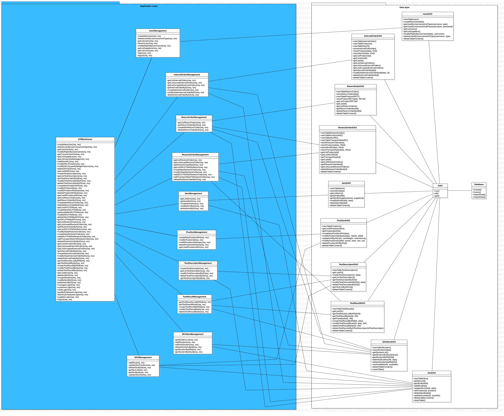
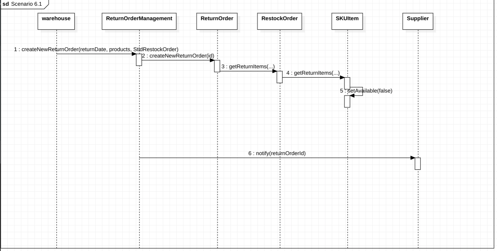
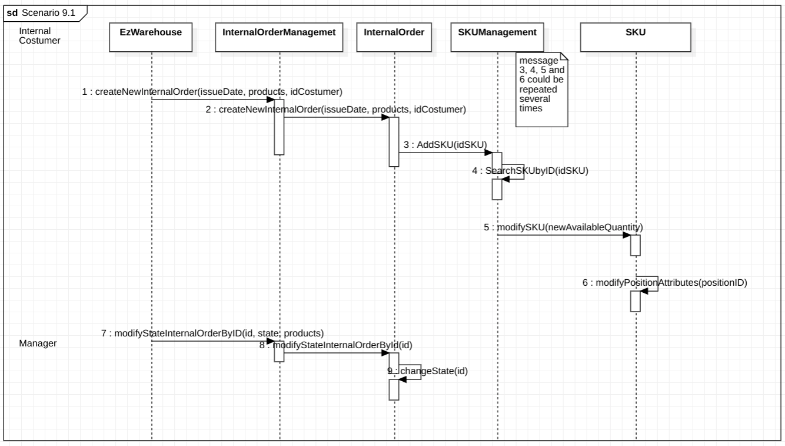

# Design Document 

Authors: 

Date: 27 April 2022

Version: 1.1

# Contents

- [Design Document](#design-document)
- [Contents](#contents)
- [Instructions](#instructions)
- [High level design](#high-level-design)
- [Low level design](#low-level-design)
- [Verification traceability matrix](#verification-traceability-matrix)
- [Verification sequence diagrams](#verification-sequence-diagrams)
  - [Scenario 5.1](#scenario-51)
  - [Scenario 5.2](#scenario-52)
  - [Scenario 6.1](#scenario-61)
  - [Scenario 9.1](#scenario-91)

# Instructions

The design must satisfy the Official Requirements document, notably functional and non functional requirements, and be consistent with the APIs

# High level design 

For what concern high level design we used the 3 tier architecture. We focused our attention on the Application and data layers since the frontend is provided to us.

# Low level design

For the low level design we used a facade class (EzWarehouse) which is the point of interaction between frontend and backend. After that we consider different management classes that implements and solve the API requests using functions in the DAOs communicating with the database.

# Verification traceability matrix

According to the Application Layer

||EZWarehouse| UserManagement | PositionManagement | SKUItemManagement  | ReturnOrderManagement | RestockOrderManagement | ItemManagement | InternalOrderManagement | SKUManagement | TestDescriptorManagement | TestResultManagement |
| --- |:---|:---|:---|:---|:---|:---|:---|:---|:---|:---|:---|
|FR1     |X|X| | | | | | | | ||
|FR1.1   |X|X| | | | | | | | ||
|FR1.2   |X|X| | | | | | | | ||
|FR1.3   |X|X| | | | | | | | ||
|FR1.4   |X|X| | | | | | | | ||
|FR1.5   |X|X| | | | | | | | ||
|FR2     |X| | | | | | | |X| ||
|FR2.1   |X| | | | | | | |X| ||
|FR2.2   |X| | | | | | | |X| ||
|FR2.3   |X| | | | | | | |X| ||
|FR2.4   |X| | | | | | | |X| ||
|FR3     |X| |X| | | | | | | ||
|FR3.1   |X| |X| | | | | | | ||
|FR3.1.1 |X| |X| | | | | | | ||
|FR3.1.2 |X| |X| | | | | | | ||
|FR3.1.3 |X| |X| | | | | | | ||
|FR3.1.4 |X| |X| | | | | | | ||
|FR3.2   |X| | | | | | | | |X||
|FR3.2.1 |X| | | | | | | | |X||
|FR3.2.2 |X| | | | | | | | |X||
|FR3.2.3 |X| | | | | | | | |X||
|FR4     |X|X| | | | | | | | ||
|FR4.1   |X|X| | | | | | | | ||
|FR4.2   |X|X| | | | | | | | ||
|FR4.3   |X|X| | | | | | | | ||
|FR4.4   |X|X| | | | | | | | ||
|FR5     |X| | |X|X|X| | | | ||
|FR5.1   |X| | | | |X| | | | ||
|FR5.2   |X| | | | |X| | | | ||
|FR5.3   |X| | | | |X| | | | ||
|FR5.4   |X| | | | |X| | | | ||
|FR5.5   |X| | | | |X| | | | ||
|FR5.6   |X| | | | |X| | | | ||
|FR5.7   |X| | | | |X| | | | ||
|FR5.8   |X| | |X| |X| | | | ||
|FR5.8.1 |X| | |X| |X| | | | ||
|FR5.8.2 |X| | | | |X| | | | |X|
|FR5.8.3 |X| |X| | |X| | | | ||
|FR5.9   |X| | | |X|X| | | | ||
|FR5.10  |X| | | |X|X| | | | ||
|FR5.11  |X| | | |X|X| | | | ||
|FR5.12  |X| | | |X|X| | | | ||
|FR6     |X| | | | | | |X| | ||
|FR6.1   |X| | | | | | |X| | ||
|FR6.2   |X| | | | | | |X| | ||
|FR6.3   |X| | | | | | |X| | ||
|FR6.4   |X| | | | | | |X| | ||
|FR6.5   |X| | | | | | |X| | ||
|FR6.6   |X| | | | | | |X| | ||
|FR6.7   |X| | | | | | |X| | ||
|FR6.8   |X| | | | | | |X| | ||
|FR6.9   |X| | | | | | |X| | ||
|FR6.10  |X| | | | | | |X| | ||
|FR7     |X| | | | | |X| | | ||

# Verification sequence diagrams 

## Scenario 5.1

## Scenario 5.2

## Scenario 6.1

## Scenario 9.1

