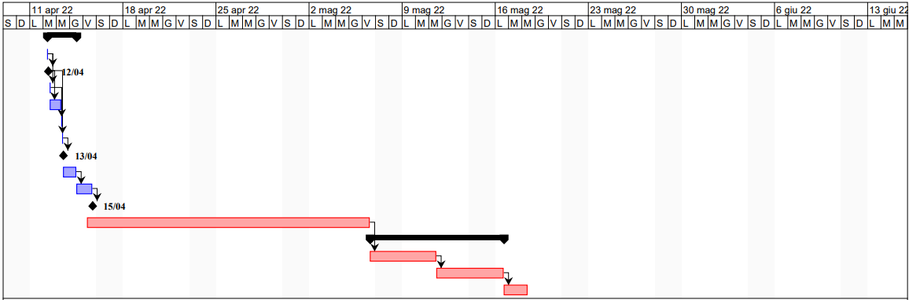

# Project Estimation  
Date: 10 April 2022

Version: 1.0

# Estimation approach
Consider the EZWH  project as described in YOUR requirement document, assume that you are going to develop the project INDEPENDENT of the deadlines of the course
# Estimate by size
### 
|             | Estimate                        |             
| ----------- | ------------------------------- |  
| NC =  Estimated number of classes to be developed   |        42                   |             
| A = Estimated average size per class, in LOC       |        250                  | 
| S = Estimated size of project, in LOC (= NC * A) | 10500 |         
| E = Estimated effort, in person hours (here use productivity 10 LOC per person hour)  |    1050     |   
| C = Estimated cost, in euro (here use 1 person hour cost = 30 euro) | 31500| 
| Estimated calendar time, in calendar weeks (Assume team of 4 people, 8 hours per day, 5 days per week ) |  6,6    |               

# Estimate by product decomposition
### 
|         component name    | Estimated effort (person hours)   |             
| ----------- | ------------------------------- | 
| requirements document   | 60 |
| GUI prototype | 30 |
| design document | 50 |
| code | 500 |
| unit tests | 100 |
| api tests | 100 |
| management documents  | 50 |

# Estimate by activity decomposition
### 
|         Activity name    | Estimated effort (person hours)   |             
| ----------- | ------------------------------- | 
| Define stakeholders                   | 4  |
| Define FR                             | 14 |
| Define NFR                            | 2  |
| Define Use Cases and Scenarios        | 20 |
| Draw diagrams                         | 8  |      
| Define stories and personas           | 4  |
| GUI prototype                         | 30 |
| Produce design document               | 50 |
| Write code                            | 500 |
| Do unit tests                         | 100 |
| Do api tests                          | 100 |
| Produce management documents          | 50 |

###
Insert here Gantt chart with above activities

# Summary

Report here the results of the three estimation approaches. The  estimates may differ. Discuss here the possible reasons for the difference

|             | Estimated effort (person hours)    |   Estimated duration (calendar weeks) |          
| ----------- | ------------------------------- | ---------------|
| estimate by size | 1050 | 6,6 |
| estimate by product decomposition | 890 | 5,6 |
| estimate by activity decomposition | 882 | 5,5 |

