# Graphical User Interface Prototype  

Authors:

Date: 11 april 2022

Version: 1.0

| Version 1.0 | Add UC1 and UC2 |

\<Report here the GUI that you propose. You are free to organize it as you prefer. A suggested presentation matches the Use cases and scenarios defined in the Requirement document. The GUI can be shown as a sequence of graphical files (jpg, png)  >

### Use case 1, UC1 - Manage users and rights

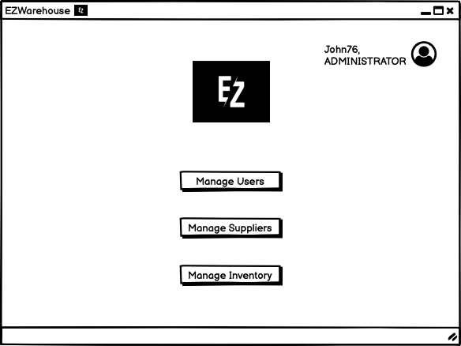

Admin Home Page

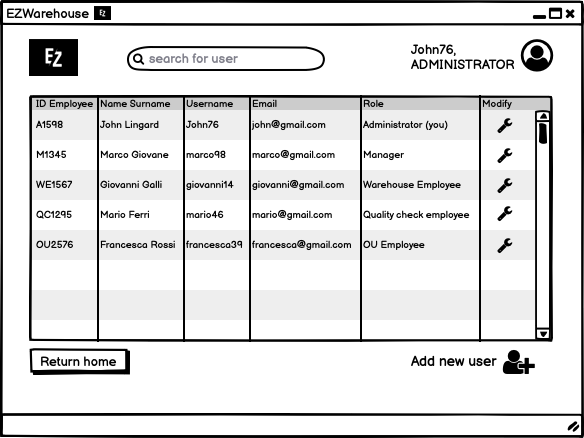

User List

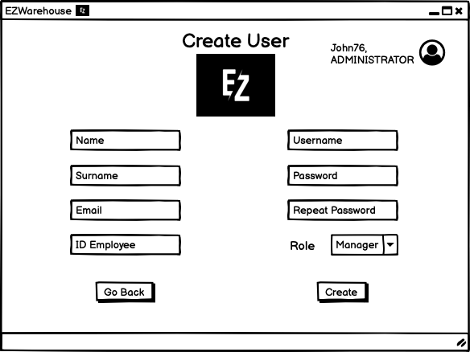

Create User

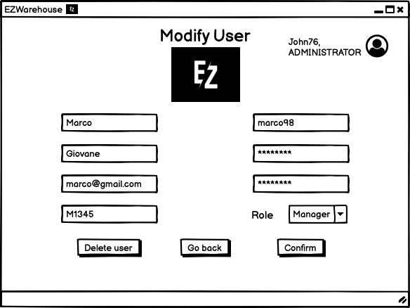

Modify User

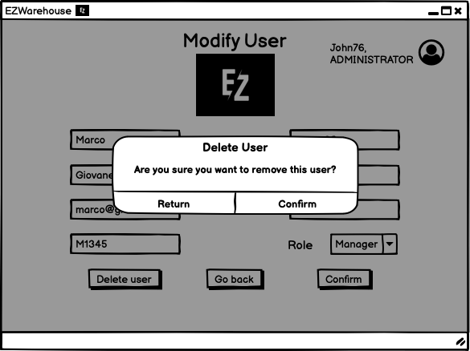

Delete User

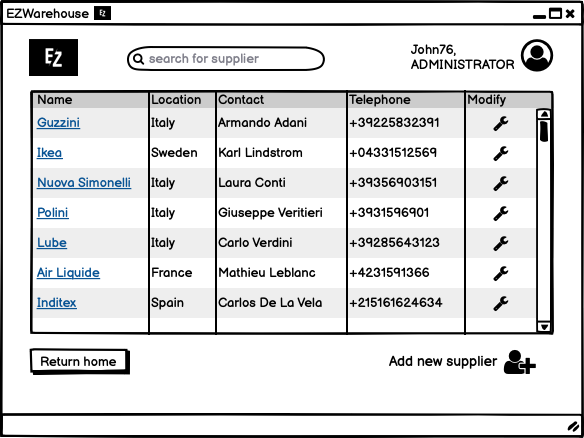

Supplier List

Create Supplier

Modify Supplier

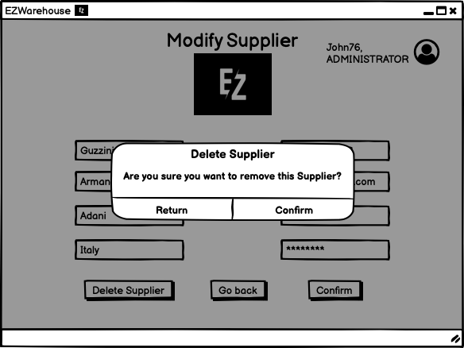

Delete Supplier

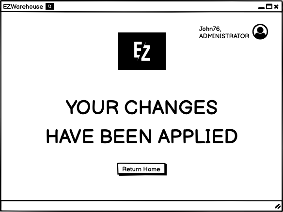

Changes Applied

### Use case 2, UC2 - Manage inventory

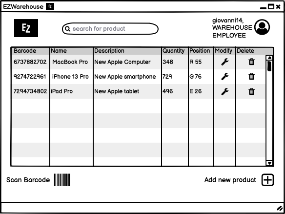

Warehouse Employee Home Page

Add new product to the inventory

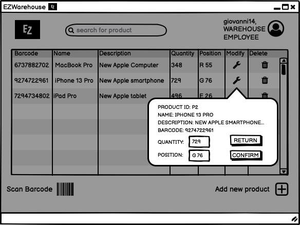

Modify quantity or position of a product

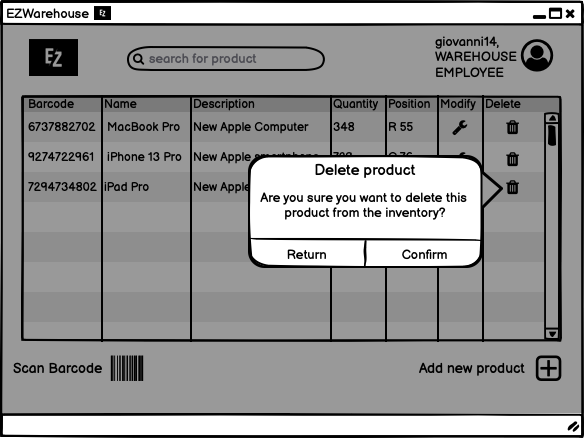

Delete product from inventory

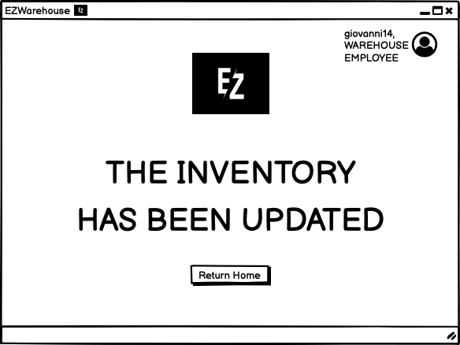

Inventory has been updated

Format Error

