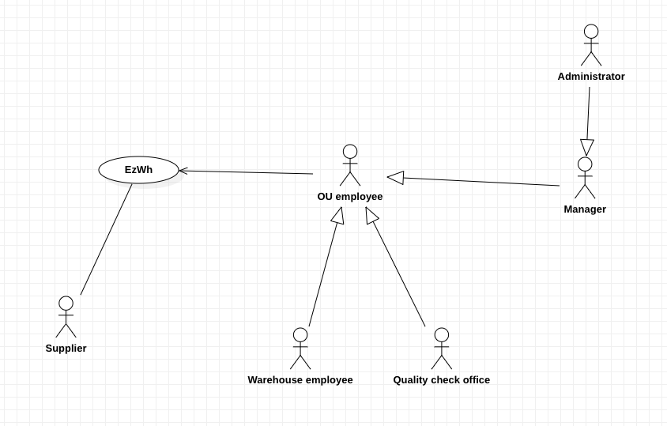
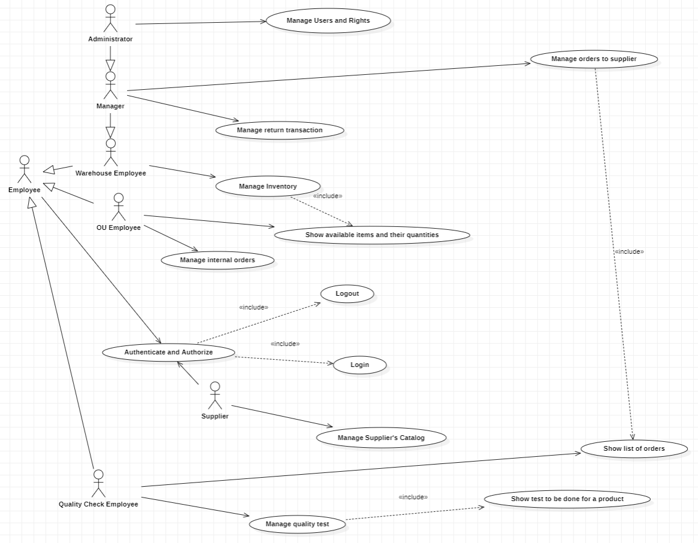
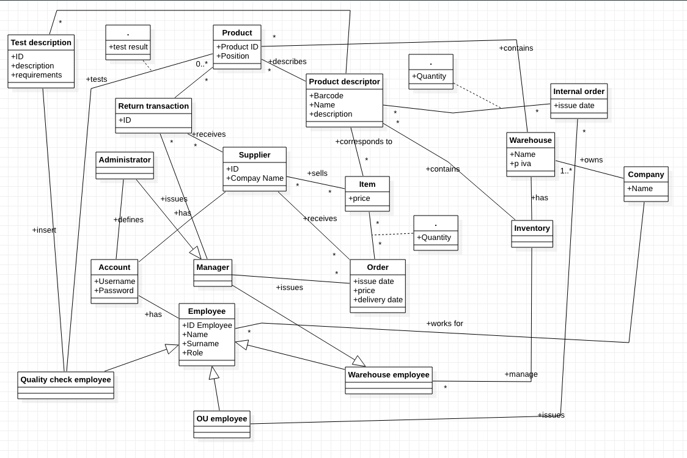
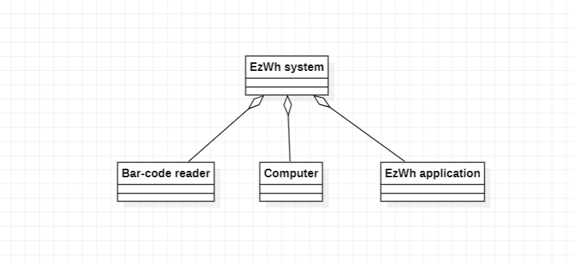
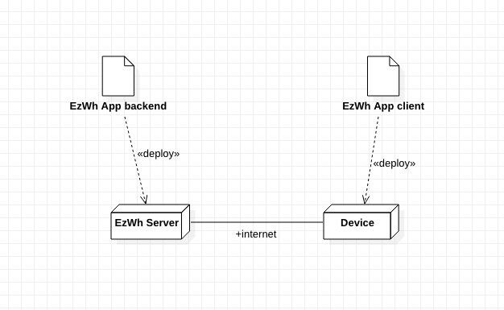

 #Requirements Document 

Date: 11 april 2022

Version: 1.7

 
| Version number | Change |
| ----------------- |:-----------|
| 0   | Added Stakeholders, context diagram, FR|
| 1.1 | Fixed Stakeholders, Context Diagram, FR. Added NFR and Deployment Diagram | 
| 1.2 | Add functional requirements, modify context diagram |
| 1.3 | Add use case diagram |
| 1.4 | Add use case 1,2. Add Stories and personas WE. Add access right table |
| 1.5 | Add use case 6, 8. Add stories and personas QCE. |
| 1.6 | Add Glossary |
| 1.7 | Add System Design |

# Contents

- [Informal description](#informal-description)
- [Stakeholders](#stakeholders)
- [Context Diagram and interfaces](#context-diagram-and-interfaces)
	+ [Context Diagram](#context-diagram)
	+ [Interfaces](#interfaces) 
	
- [Contents](#contents)
- [Informal description](#informal-description)
- [Stakeholders](#stakeholders)
- [Context Diagram and interfaces](#context-diagram-and-interfaces)
	- [Context Diagram](#context-diagram)
	- [Interfaces](#interfaces)
- [Stories and personas](#stories-and-personas)
		- [Persona](#persona)
		- [Persona](#persona-1)
		- [Persona](#persona-2)
- [Functional and non functional requirements](#functional-and-non-functional-requirements)
	- [Functional Requirements](#functional-requirements)
		- [Access right, actor vs function](#access-right-actor-vs-function)
	- [Non Functional Requirements](#non-functional-requirements)
- [Use case diagram and use cases](#use-case-diagram-and-use-cases)
	- [Use case diagram](#use-case-diagram)
		- [Use case 1, UC1 - Manage users and rights](#use-case-1-uc1---manage-users-and-rights)
				- [Scenario 1-1](#scenario-1-1)
				- [Scenario 1-2](#scenario-1-2)
				- [Scenario 1-3](#scenario-1-3)
		- [Use case 2, UC2 - Manage inventory](#use-case-2-uc2---manage-inventory)
				- [Scenario 2-1](#scenario-2-1)
				- [Scenario 2-2](#scenario-2-2)
				- [Scenario 2-3](#scenario-2-3)
				- [Scenario 2-4](#scenario-2-4)
				- [Scenario 2-5](#scenario-2-5)
				- [Scenario 2-6](#scenario-2-6)
				- [Scenario 2-7](#scenario-2-7)
		- [Use case 3, UC3 - Manage supplier's catalog](#use-case-3-uc3---manage-suppliers-catalog)
				- [Scenario 3-1](#scenario-3-1)
				- [Scenario 3-2](#scenario-3-2)
				- [Scenario 3-3](#scenario-3-3)
				- [Scenario 3-4](#scenario-3-4)
				- [Scenario 3-5](#scenario-3-5)
				- [Scenario 3-6](#scenario-3-6)
		- [Use case 4, UC4 - Manage orders to supplier](#use-case-4-uc4---manage-orders-to-supplier)
				- [Scenario 4-1](#scenario-4-1)
				- [Scenario 4-2](#scenario-4-2)
				- [Scenario 4-3](#scenario-4-3)
				- [Scenario 4-4](#scenario-4-4)
				- [Scenario 4-5](#scenario-4-5)
				- [Scenario 4-6](#scenario-4-6)
		- [Use case 5, UC5 Manage internal orders](#use-case-5-uc5-manage-internal-orders)
				- [Scenario 5-1](#scenario-5-1)
				- [Scenario 5-2](#scenario-5-2)
				- [Scenario 5-3](#scenario-5-3)
				- [Scenario 5-4](#scenario-5-4)
				- [Scenario 5-5](#scenario-5-5)
				- [Scenario 5-6](#scenario-5-6)
				- [Scenario 5-7](#scenario-5-7)
		- [Use case 6, UC6 - Manage return transaction](#use-case-6-uc6---manage-return-transaction)
				- [Scenario 6-1](#scenario-6-1)
		- [Use case 7, UC7 - Authenticate](#use-case-7-uc7---authenticate)
				- [Scenario 7-1](#scenario-7-1)
				- [Scenario 7-2](#scenario-7-2)
		- [Use case 8, UC8 : Manage quality test](#use-case-8-uc8--manage-quality-test)
				- [Scenario 8-1](#scenario-8-1)
				- [Scenario 8-2](#scenario-8-2)
				- [Scenario 8-3](#scenario-8-3)
- [Glossary](#glossary)
- [System Design](#system-design)
- [Deployment Diagram](#deployment-diagram)

# Informal description
Medium companies and retailers need a simple application to manage the relationship with suppliers and the inventory of physical items stocked in a physical warehouse. 
The warehouse is supervised by a manager, who supervises the availability of items. When a certain item is in short supply, the manager issues an order to a supplier. In general the same item can be purchased by many suppliers. The warehouse keeps a list of possible suppliers per item. 

After some time the items ordered to a supplier are received. The items must be quality checked and stored in specific positions in the warehouse. The quality check is performed by specific roles (quality office), who apply specific tests for item (different items are tested differently). Possibly the tests are not made at all, or made randomly on some of the items received. If an item does not pass a quality test it may be rejected and sent back to the supplier. 

Storage of items in the warehouse must take into account the availability of physical space in the warehouse. Further the position of items must be traced to guide later recollection of them.

The warehouse is part of a company. Other organizational units (OU) of the company may ask for items in the warehouse. This is implemented via internal orders, received by the warehouse. Upon reception of an internal order the warehouse must collect the requested item(s), prepare them and deliver them to a pick up area. When the item is collected by the other OU the internal order is completed. 

EZWH (EaSy WareHouse) is a software application to support the management of a warehouse.

# Stakeholders

| Stakeholder name  | Description | 
| ----------------- |:-----------:|
|  Administrator  		| Handles application maintenance (bugs), handles user privileges | 
|  Manager  			| Has information about the inventory and manages stock of products | 
|  Supplier  			| Receive orders and provides items | 
|  Warehouse employee 	| Collects items and store them into the warehouse, handles the inventory, provides the request items to the pick up area |  
| OU employee     		| Issue internal orders, pick them from pick up area | 
| Quality check office 	| Test quality of supplies | 

# Context Diagram and interfaces

## Context Diagram

\<actors are a subset of stakeholders>

## Interfaces
\<describe here each interface in the context diagram>

\<GUIs will be described graphically in a separate document>

| Actor | Logical Interface | Physical Interface  |
| ------------- |:-------------:| -----:|
| Administrator 		| GUI 	    | screen, keyboard |
| Manager 				| GUI   	| screen, keyboard |
| Supplier 				| GUI 		| screen, keyboard |
| Warehouse employee 	| GUI 		| screen, keyboard |
| OU employee 			| GUI 		| screen, keyboard |
| Quality check employee| GUI 		| screen, keyboard |

# Stories and personas
\<A Persona is a realistic impersonation of an actor. Define here a few personas and describe in plain text how a persona interacts with the system>

\<Persona is-an-instance-of actor>

\<stories will be formalized later as scenarios in use cases>

### Persona
Persona:Jhon White, 46 years old, Manager, future father, married,charismatic.

Work day: Wakes up early, checks the emails, goes to the office, organizes meetings, reads the report of quality check office, handles the different issues related to the warehouse company, goes to the gym, watch a film with his wife, checks the email, goes to sleep.

Weekend day: wake up early, goes to visit his parents, makes jogging, helps his wife to clean the house, goes to a pub.

Goal: Jhon wants to make the orders and handles them in the easiest possible way.

Story:
As every morning, Jhon check his emails, in order to start thinking to the possible solutions for the new issues. He has a lots of responsability: indeed he has to monitor the status of the orders and the items, with their quantities.
Sometimes he has difficulties due to the internal orders, coming from the OU employees, because some transaction are not registered: in this way the information about the quantities of the items are no longer consistent.
However he has to work hard because he must keep trace about the items that are nearly out of orders. By doing so he can create a new orders, selecting a specific suppliers, and require the needed quantity of items for the company. 

### Persona
Persona: Peter Jacobs (Warehouse employee): Male, young, recently started working, low income, not married.

Work day: wake up, breakfast, drive to the warehouse, work for 8 hours with a pause for lunch, drive to the home, shower, watch a film, go to sleep.

Weekend day: wake up, breakfast, takes a walk, lunch, shower, go out with friends or girlfriend, go to sleep.

Peter's job is to put in order the products that arrive and manage the inventory. The inventory is currently on a paper ledger, which is very difficult to update.

Goal: wants to manage inventory more efficiently

Story: It's Thursday afternoon, a new order has been received and Peter needs to sort out the items. He wants to be fast. Peter rearranges the items together with his colleagues. The app help him be fast and not waste his time because he can see the position where the product are to be stored and the inventory will be updated automatically. The order contains a product that has never been ordered before so Peter has to put it in the inventory, thanks to the app this is a much easier and faster process than before, so Peter comes home as soon as he finishes, he wants to do it as soon as possible because tonight at 8 pm there is the Champions League match of his favorite team and he doesn't want to be late.

### Persona

Persona: Christian Red (Quality Check employee): medium income, male, married, with cildren, 50 yo, bad memory

Work day: wake up early, breakfast, drive children to school, go to office, deals with quality tests of objects, returns home, watch tv, goes to sleep.

Weekend day: wake up late, goes out with his wife and children, returns home, watch tv, goes to sleep.

Christian's job is to do and report result of tests on various object. Currently, the list of products and related tests is on paper. Searching tests for items is very boring, time consuming and error-prone procedure.

Goal: wants to retrieve information about tests faster, without errors.

Story: It's monday morning, he spent the night awake because of his children. He arrives at the office and has to know all tests 
that needs to be done for the objects he must test. He is really tired but cannot make mistakes. Thanks to the EzWh app he can safely and easily find the informations he needs.

### Persona

Persona: Enrico Pasquale (Supplier), Owner of farm, Male, 30 years old and low level of education

Work day: Wakes up early, he has to take care of his farm by handling the watering, fertilization and pruning of his crops and trees. 

Weekend: Wakes up later in order to go back to his hometown and visit his parents. 

Enrico Pasquale  is a farmer, he works hard, and therefore, its troublesome for him to handle all the calls that arrive to order his products, 
he may miss some important business opportunities and therefore really needs a quicker and intuitive method to sell its products to the market. 

Goal: A more efficient way to handle sales and record their history.

Story: Enrico Pasquale also really needs to get ready for the work week by knowing which products were the ones that were most sold.
Having an idea of which are the products more in demand, to figure out how to make the most sales, EzWh may help him in being able to afford the car of his dreams.

# Functional and non functional requirements

## Functional Requirements

\<In the form DO SOMETHING, or VERB NOUN, describe high level capabilities of the system>

\<they match to high level use cases>

| ID        | Description  |
| ------------- |:-------------:| 
| FR1    	| Manage user and rights (user Administaror, Manager, Employee and supplier) |
| FR1.1		| Create a new user or modify an existing user |
| FR1.2    	| Delete a user |
| FR1.3  	| List all users | 
| FR1.4		| Search a user |
| FR1.5		| Manage rights. Authorize access to functions to specific actors according to access right |
| | |
| FR2		| Manage Inventory |
| FR2.1		| Modify quantity available for a product in the warehouse |
| FR2.2		| Modify position for a product |
| FR2.3		| Show available products and their quantities |
| FR2.4		| Search for location of a certain products |
| FR2.5		| Compute available space |
| FR2.6		| Add new product |
| FR2.7		| Delete product |
| FR2.8		| Search product |
| | |
| FR3		| Manage suppliers catalog |
| FR3.1		| Add new item |
| FR3.2		| Modify item |
| FR3.3		| Delete item |
| FR3.4		| List all items |
| FR3.5		| Search for an item |
| | |
| FR4		| Manage order to supplier |
| FR4.1		| Create order to supplier |
| FR4.2		| Add items to order |
| FR4.3		| Select quantity of a certain item |
| FR4.4		| Delete product from order |
| FR4.5		| Delete order |
| FR4.6		| Confirm order |
| FR4.7		| Start a return transaction of faulty items |
| FR4.8		| Send back faulty items of a previous order |
| FR4.9		| Close a return transaction of faulty items |
| FR4.10	| List all orders (active, closed) |
| FR4.11	| Display different supplier and their items |
| FR4.12	| Search item from supplier |
| | |
| FR5		| Manage internal order |
| FR5.1		| Create internal order |
| FR5.2		| Select available item from warehouse inventory |
| FR5.3		| Add product to internal order |
| FR5.4		| Delete product from internal order |
| FR5.5		| Confirm internal order |
| FR5.6		| Delete internal order |
| FR5.7		| Show internal order history |
| | |
|  FR6 		| Send alert for a specific case | 
|  FR6.1 	| Send alert message when the quantity of a certain item is under a certain threshold |
|  FR6.2	| Send alert message when the available physical space is under a certain threshold |
|  FR6.3 	| Send alert message when some items do not pass the quality check |
|  FR6.4	| Send alert message when an order is received |
|  FR6.5 	| Send alert message when item is in the pick up area |
| | |
|  FR7		| Manage quality check |
|  FR7.1	| Select product to check from an order |
|  FR7.2	| Show test to be done for a certain product |
|  FR7.3	| Report test result |
|  FR7.4	| Add test to a product |
| | |
| FR8 		| Authenticate and Authorize |
| FR8.1		| Login |
| FR8.2		| Logout |

### Access right, actor vs function

| Function | Administrator | Manager | Warehouse Employee | OU employee | Quality check employee | Supplier |
| -------- | ----- | ------------ | ------- | --------| -------- | --------- |
| FR1 | yes | no  | no  | no  | no  | no  |
| FR2 | yes | yes | yes | no  | no  | no  |
| FR3 | no  | no  | no  | no  | no  | yes |
| FR4 | yes | yes | no  | no  | no  | no  |
| FR5 | no  | no  | no  | yes | no  | no  |
| FR7 | no  | no  | no  | no  | yes | no  |
| FR8 | yes | yes | yes | yes | yes | yes |

## Non Functional Requirements

\<Describe constraints on functional requirements>

| ID        | Type (efficiency, reliability, ..)           | Description  | Refers to |
| ------------- |:-------------:| :-----:| -----:|
|  NFR1     | Usability 	| Application should be used with no specific training for the users | All FR |
|  NFR2     | Performance 	| All functions should complete in < 0.5 sec  | All FR |
|  NFR3     | Privacy		| The data should not be disclosed outside the application | All FR |
|  NFR4 	| Reliability 	| Maximum of one failure over 1 year | All FR | 

# Use case diagram and use cases

## Use case diagram

\<next describe here each use case in the UCD>

### Use case 1, UC1 - Manage users and rights

| Actors Involved        | Administrator |
| ------------- |:-------------:|
|  Precondition | Administrator A exists and is logged in |
|  Post condition |  |
|  Nominal Scenario |  A defines a new user and its access rights  |
|  Variants     | A modifies access rights or other fields of an existing user |

##### Scenario 1-1

| Scenario |  Create new user and define it’s rights |
| ------------- |:-------------:| 
|  Precondition     | Admin A exists and is logged in |
|  Post condition     | Account C is created |
| Step#        | Description  |
|  1    |  A defines the credentials of the new Account C |  
|  2    |  A selects the access rights for the new account C |
|  3    |  A confirms the inserted data |

##### Scenario 1-2

| Scenario |  Delete user |
| ------------- |:-------------:| 
|  Precondition     | Admin A exists and is logged in |
|  | Account C exists |
|  Post condition     | Account C deleted |
| Step#        | Description  |
|  1    |  A selects account C  |
|  2    |  C deleted from the system |

##### Scenario 1-3

| Scenario |  Modify user rights |
| ------------- |:-------------:| 
|  Precondition     | Admin A exists and is logged in |
|  | Account C exists |
|  Post condition     | C's rights modified |
| Step#        | Description  |
|  1    |  A selects account C  |
|  2    |  A modify the access rights for C |
|  3    |  A confirms the inserted data |

### Use case 2, UC2 - Manage inventory

| Actors Involved        | Warehouse employee WE |
| ------------- |:-------------:|
|  Precondition | Warehouse employee WE exists and is logged in |
|  Post condition | |
|  Nominal Scenario | The Warehouse employee is able to make changes to the warehouse inventory |
|  Variants  | Show available products and their quantities |
| | Add new product to the inventory |
| | Delete product from inventory |
| | Update product quantity |
| | Modify PT position in the warehouse |
| | Seach product by barcode |
| Exception | Format error |

##### Scenario 2-1

| Scenario | Show available products and their quantities |
| ------------- |:-------------:| 
|  Precondition     | Warehouse employee WE exists and is logged in |
|  Post condition   | |
| Step#        | Description  |
|  1    |  WE open the inventory |
|  2    |  WE read products and their quantities from a list |

##### Scenario 2-2

| Scenario | Add new product to the inventory |
| ------------- |:-------------:| 
|  Precondition     | Warehouse employee WE exists and is logged in |
|  | Product PT doesn’t exist in the inventory |
|  | Product PT exists in order O |
|  | Position P is free |
|  Post condition     | PT added to the inventory |
|  | PT.units = O.units |
|  | PT.position = P |
| Step#        | Description  |
|  1    |  WE insert new product description |
|  2	|  WE insert new product barcode |
|  3    |  WE inserts new product notes |
|  4    |  WE enters position of PT |
|  5    |  WE confirms the entered data |

##### Scenario 2-3

| Scenario | Delete product from inventory |
| ------------- |:-------------:| 
|  Precondition     | Warehouse employee WE exists and is logged in |
|  | Product type PT exists |
|  Post condition     | product deleted from the inventory |
|  | PT.position = free |
| Step#        | Description  |
|  1    |  WE searches PT in the inventory by Name |
|  2    |  WE selects PT's record |
|  3    |  WE delete product |
|  4    |  WE confirm the deletion |

##### Scenario 2-4

| Scenario | Update quantity of product PT after a sale S |
| ------------- |:-------------:| 
|  Precondition     | Warehouse employee WE exists and is logged in |
| | Product PT exists in the inventory |
| | Warehouse sells a product |
|  Post condition     | PT.units -= S.units  |
| Step#        | Description  |
|  1    |  WE searches PT in the inventory by Name |
|  2    |  WE selects PT's record |
|  3    |  WE insert a new available quantity for a product |
|  4    |  WE confirms the entered data |

##### Scenario 2-5

| Scenario | Modify PT position in the warehouse |
| ------------- |:-------------:| 
|  Precondition     | Warehouse employee WE exists and is logged in |
|  | Product type PT exists |
|  | Position P is free |
|  Post condition     |  PT.Old_position = free |
|  | PT.New_position = P |
| Step#        | Description  |
|  1    |  WE searches PT in the inventory by Name |
|  2    |  WE selects PT's record |
|  3    |  WE selects a new position for a product |
|  4    |  WE confirms the entered data |

##### Scenario 2-6

| Scenario | Search product by barcode |
| ------------- |:-------------:| 
|  Precondition     | Warehouse employee WE exists and is logged in |
|  | Product type PT exists |
|  | Position P is free |
|  Post condition     |  PT.Old_position = free |
|  | PT.New_position = P |
| Step#        | Description  |
|  1    |  WE scans the product barcode |
|  2    |  The system find the product |
|  3    |  WE can read the information that he need |
|  4    |  WE confirms the entered data |

##### Scenario 2-7

| Scenario | Format error |
| ------------- |:-------------:| 
|  Precondition     | Warehouse employee WE exists and is logged in |
|  Post condition   | Product non added to the inventory |
| Step#        | Description  |
|  1    |  WE insert new product description |
|  2	|  WE insert new product barcode |
|  3    |  WE inserts new product notes |
|  4    |  WE enters position of PT |
|  5    |  User makes mistake in input format |
|  6    |  Alert shown notifying about Input Error |
|  7    |  Input cleared |

### Use case 3, UC3 - Manage supplier's catalog

| Actors Involved        |  Supplier |
| ------------- |:-------------:| 
|  Precondition     | Supplier exists and is logged in |
|  Post condition     | Changes to Database are made and are coherent |
|  Nominal Scenario     | The supplier, via the app, is supposed to be able to manage the list of items they are able to supply to the warehouse  |
|  Variants     | Add item, Modify item, Delete item |
|  Exceptions     | Input Error, Item not found, Item match |

##### Scenario 3-1

| Scenario | Add Item |
| ------------- |:-------------:| 
|  Precondition     | Supplier must be able to provide item |
|  Post condition     | Item correctly stored into the catalog |
| Step#        | Description  |
|  1     | Open Add Item page |  
|  2     | Fill information about Item |
|  3     | Input Item Quantity |
|  4     | Confirm Item Storage |
|  5     | Item is stored into catalog |

##### Scenario 3-2

| Scenario | Item Match |
| ------------- |:-------------:| 
|  Precondition     | At least one Item in catalog |
|  Post condition     | Item not stored into Catalog Database |
| Step#        |   |
|  1     | Open Add Item page |  
|  2     | Fill information about Item |
|  3     | Input Item Quantity |
|  4     | Item Name is match inside system |
|  5     | Error Message displayed about Item match |
|  6     | Item not stored into catalog |

##### Scenario 3-3

| Scenario | Input Error |
| ------------- |:-------------:| 
|  Precondition     | Supplier must be able to provide item |
|  Post condition     | Item not stored into Catalog and user able to re-enter data |
| Step#        | Description  |
|  1     | Open Add Item page |  
|  2     | Fill information about Item |
|  3     | Input Item Quantity |
|  4     | Something wrong with the format of input |
|  5     | Error Message displayed about Input Error |
|  6     | Item not stored into catalog |
|  7     | Input cleared |

##### Scenario 3-4

| Scenario | Modify Item |
| ------------- |:-------------:| 
|  Precondition     | At least one Item in Catalog |
|  Post condition     | Item data modified in Catalog Database |
| Step#        | Description  |
|  1     | Open Catalog View |  
|  2     | User inputs search bar |
|  3     | Query is made to Database |
|  4     | Items respecting requirements shown |
|  5     | Select Item to change |
|  6     | Change Item information and/or quantity |
|  7     | Confirm Changes |
|  8     | Item data is modified in Catalog Database |

##### Scenario 3-5

| Scenario | Delete Item |
| ------------- |:-------------:| 
|  Precondition     | At least one Item in Catalog |
|  Post condition     | Item data deleted from Catalog Database |
| Step#        | Description |
|  1     | Open Catalog View |  
|  2     | User inputs search bar |
|  3     | Query is made to Database |
|  4     | Items respecting requirements shown |
|  5     | Select Item to delete |
|  7     | Confirm Changes |
|  8     | Item data is deleted from Catalog Database |

##### Scenario 3-6

| Scenario | Item not found |
| ------------- |:-------------:| 
|  Precondition     | At least one Item in Catalog |
|  Post condition     | Item not found |
| Step#        | Description |
|  1     | Open Catalog View |  
|  2     | User inputs search bar |
|  3     | Query is made to Database |
|  7     | No item found respecting query |
|  7     | No item shown |
|  7     | Error Message displayed about Search not conclusive |

### Use case 4, UC4 - Manage orders to supplier
| Actors Involved        | Manager M, Warehouse Employee WE, Supplier S |
| ------------- |:-------------:| 
|  Precondition     | the user has to be logged as manager M; |
|					|	the suppliers S have to upload their list of items |
|  Post condition     | The order is confirmed |
|  Nominal Scenario  | M makes an order of the nearly out of order items |
|  Variants |  The order is deleted;|
|			 | M checks the list of the orders;|
|			 | M receives the order and update the system|
| Exceptions | The order fails |

##### Scenario 4-1
| Scenario | M creates an order |
| ------------- |:-------------:| 
| Precondition | the user has to be logged as manager M;|
|			 |the suppliers S have to upload their list of items|
|Postcondition | The order is created |	 
| Step # | Description |
| 1 | M checks the quantity of the nearly out of order products |
| 2 | M checks the list of suppliers |
| 3 | M selects the specific supplier |
| 4 | M selects the needed quantity of an item |
| 5 | S receivs the order |
| 7 | M receivs a confirmation notification |
| 8 | The order is created | 

##### Scenario 4-2
| Scenario | M deletes an order |
| ------------- |:-------------:| 
| Precondition | the user has to be logged as manager M;|
| 	|  M has to had made an order but is not already arrived |
|			 |the suppliers S have to upload their list of items|
|Postcondition | The order is deleted |	 
| Step # | Description |
| 1 | M checks the list of active orders |
| 2 | M decides to delete one order | 
| 3 | The order selected is correctly deleted |

##### Scenario 4-3
| Scenario | M checks the status of active orders |
| ------------- |:-------------:| 
| Precondition | the user has to be logged as manager M;|
| 	|  M has to had made at least one order that is not alreay arrived.  |
|Postcondition |  |	 
| Step # | Description |
| 1 	| M checks the list of active orders |
| 2 | M checks the status of an order |

##### Scenario 4-4
| Scenario |M modifies an order|
| ------------- |:-------------:| 
| Precondition | the user has to be logged as manager M;|
| 	| M made an order but is not yet arrived.  |
|Postcondition | The order is correctly updated |	 
| Step # | Description |
| 1 	| M checks the list of active orders |
| 2 | M checks the status of an order |
| 3 | M modifies the quantity of a certain item or adds new item |
| 4 | The order is correctly updated |

##### Scenario 4-5
| Scenario |M notifies the arrival of an order to WE|
| ------------- |:-------------:| 
| Precondition | the user has to be logged as manager M;
| | the order has to be arrived |
|Postcondition | The order is taken in charge by the WE |	 
| Step # | Description |
| 1 | M receives the notification for the arrival of an order |
| 2 | M sends a notification to the WE |

##### Scenario 4-6
| Scenario |M confirms the order that is just arrived|
| ------------- |:-------------:| 
| Precondition | An order has to be arrived;|
| |  |
|Postcondition | The system is updated |
| | Products.units += Order.units |	 
| Step # | Description |
| 1 | M confirms the order |
| 2 | The system is updated |

quality

### Use case 5, UC5 Manage internal orders

| Actors Involved        | OU Employee, Warehouse Employee |
| ------------- |:-------------:| 
|  Precondition     | Connection to Database |
|  Post condition     | Order correctly sent to warehouse |
|  Nominal Scenario     | The OU Employee is supposed to be able to see the items available to order and correctly appoint an order  |
|  Variants     | |
| | Make order |
| | Delete order|
| | Show order history |
| | Order confirmed by Warehouse Employee |
|  Exceptions     | Input Error, Current Order not found, Order not found |
 
##### Scenario 5-1

| Scenario | Make order |
| ------------- |:-------------:| 
|  Precondition     | Products are in the warehouse |
|  Post condition     | Alert is sent to warehouse employees notifing about order made |
| Step#        | Description  |
|  1     | Open List of Products|  
|  2     | Select Available Products from Warehouse Inventory |
|  3     | Select the quantities |
|  4     | Confirm Order |
|  5     | Display Recap of Order |
|  6     | Order put into Database |
|  7     | Send Alert to Warehouse notifying about order |

##### Scenario 5-2

| Scenario | Input Error |
| ------------- |:-------------:| 
|  Precondition     | Products are in the warehouse |
|  Post condition     | Order not confirmed and user able to re-enter data |
| Step#        | Description |
|  1     | Open List of Products |  
|  2     | Select Products to Order |
|  3     | Select the quantities |
|  4     | User makes mistake in input format |
|  5     | Alert shown notifying about Input Error |
|  6     | Input cleared |

##### Scenario 5-3

| Scenario | Delete Order |
| ------------- |:-------------:| 
|  Precondition     | There is at least one not confirmed order ongoing |
|  Post condition     | Order is deleted from history |
|      |  Warehouse notified |
| Step#        | Description  |
|  1     | Open List of Orders currently ongoing|  
|  2     | User inputs search bar |
|  3     | Select Orders to Delete |
|  4     | Ask for confirm |
|  5     | Delete Orders from Database |
|  6     | Send Alert to Warehouse about order cancelling |
|  7     | OU Order Alert of Warehouse Employee disappears |

##### Scenario 5-4

| Scenario | Current Order not found |
| ------------- |:-------------:| 
|  Precondition     | There is at least one order ongoing |
|  Post condition     | No order displayed and user able to re-enter data |
| Step#        | Description |
|  1     | Open List of Orders currently ongoing |  
|  2     | User inputs search bar |
|  3     | Query is made to Database |
|  4     | User does not input a Number |
|  5     | Error Message shown notifying about Search not Conclusive |
|  6     | Input cleared |

##### Scenario 5-5

| Scenario | Show Order History |
| ------------- |:-------------:| 
|  Precondition     | There is at least one order made  |
|  Post condition     | No order displayed and user able to re-enter data |
| Step#        | Description  |
|  1     | Open History of Orders |  
|  2     | User inputs search bar |
|  3     | Query is made from Database |
|  4     | List of Orders shown |

##### Scenario 5-6

| Scenario | Order not found |
| ------------- |:-------------:| 
|  Precondition     | Products are in the warehouse |
|  Post condition     | Order not confirmed and user able to re-input data |
| Step#        | Description |
|  1     | Open History of Orders  |  
|  2     | User inputs search bar |
|  3     | Query is made to Database |
|  4     | Order not found given search info |
|  5     | Error Message shown notifying about Search not Conclusive |
|  6     | Input cleared |

##### Scenario 5-7

| Scenario | Order confirmed by Warehouse Employee |
| ------------- |:-------------:| 
|  Precondition     | At least one order is currently ongoing |
|  Post condition     | Order counted as confirmed |
|      | Product.units -= Order.units |
| Step#        | Description  |
|  1     | Warehouse employee opens OU Order Alert |  
|  2     | Warehouse employee confirms order |
|  3     | Database is updated |
|  4     | Order now counts as confirmed |
|  5     | OU Order Alert disappears |

### Use case 6, UC6 - Manage return transaction

| Actors Involved        | Manager M, Supplier S, Quality Check Office QCO |
| ------------- |:-------------:| 
|  Precondition     | User has to be logged as manager M; |
|				| Quality check office QCO has to make a report of the tested items |
|  Post condition     | The faulty items are sent back to the supplier S |
|  Nominal Scenario     | M receives a report from QCO and then decides to send back the faulty items to S.  |
|  Variants     | The faulty items are not sent back to the S |

##### Scenario 6-1
| Scenario |M sends back the faulty items|
| ------------- |:-------------:| 
|  Precondition     | User has to be logged as manager M; |
|				| Quality check office QCO has to make a report of the tested items |
|Postcondition | The faulty items are sent back to the supplier S |	 
| Step | Description |
| 1 | M receives the the report from QCO |
| 2 | M selects which items send back |
| 3 | M sends back the faulty items to the supplier S |

### Use case 7, UC7 : Manage quality test
| Actors Involved       | quality check employee (QCE in the following)|
| -------------         |:-------------:| 
|  Precondition         | Order has been received |
|  Post condition       | Appropriate alert sent to who it concerns |
|  Nominal Scenario     | QCE selects some products of recent orders which will be checked and report result |
|  Variants             | QCE select specific orders (specifc type of products, specific suppliers) |
|                       | QCE select products in a random fashion |
|  Exceptions           | Products are not in the wharehouse yet |
|                       | Missing barcode of product |

##### Scenario 7-1
| Scenario      | Add product to test-list |
| -------------     |:-------------:| 
|  Precondition     | QCE correctly logged in and authenticated |
|                   | Product exists in the invetory |
|                   | Barcode and ID of product exist and are correct |
|  Post condition   | Add product to test-list |
| Step#             | Description  |
|  1                | QCE opens list of recent orders |  
|  2                | QCE select some order(s) |
|  3                | System shows list of product(s) for a certain order |
|  4                | QCE add product to list of product to be tested |

##### Scenario 7-2
| Scenario      | Report of tests |
| -------------     |:-------------:| 
|  Precondition     | QCE correctly logged in and authenticated |
|                   | Product exists in the invetory |
|                   | Barcode and ID of product exist and are correct |
|  Post condition   | Appropriate alert sent to who it concerns |
| Step#             | Description  |
|  1                | QCE opens list of products to be tested |  
|  2                | QCE select some product(s) |
|  3                | QCE inserts results of test(s) |

##### Scenario 7-3
| Scenario      | Add test to product |
| -------------     |:-------------:| 
|  Precondition     | QCE correctly logged in and authenticated |
|                   | Product exists in the invetory |
|                   | Barcode of product exists and is correct |
|  Post condition   | Test added to list of tests for product |
| Step#             | Description  |
|  1                | QCE selects a product |  
|  2                | QCE inserts test id |
|  3                | QCE inserts test description |
|  4                | QCE inserts requirements for tests |

### Use case 8, UC8 - Authenticate
| Actors Involved       | Employee, Supplier (X in the following) |
| -------------         |:-------------:| 
|  Precondition         |  |
|  Post condition       |  |
|  Nominal Scenario     | Login: X enters credentials, the system checks them and grants access |
|  Variants             | Login: X enters wrong credentials, system prevent access |
|                       | Logout: X asks the system to terminate the session |

##### Scenario 8-1 

| Scenario		    | Login |
| -------------     |:-------------:| 
|  Precondition     | Account for X exists |
|  Post condition   | System grants access to X |
| Step#             | Description  |
|  1                | X enters username |  
|  2                | X enters password |
|  3                | System shows available functionalitites to X |

##### Scenario 8-2 

| Scenario      | Logout |
| -------------     |:-------------:| 
|  Precondition     | X logged in |
|  Post condition   | X logged out |
| Step#             | Description  |
|  1                | X logs out |  
|  2                | System brings X to application's login page |

# Glossary

\<use UML class diagram to define important terms, or concepts in the domain of the system, and their relationships> 

\<concepts are used consistently all over the document, ex in use cases, requirements etc>

Business rule: the barcode is unique for each product descriptor. The product id is unique for each physical product.

# System Design
\<describe here system design>

\<must be consistent with Context diagram>

# Deployment Diagram 

\<describe here deployment diagram >

