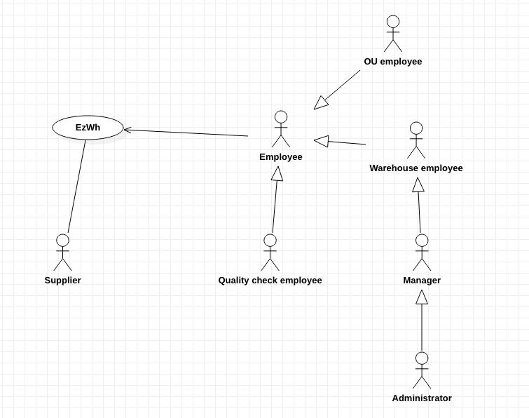

 #Requirements Document 

Date: 22 march 2022

Version: 1.1

 
| Version number | Change |
| ----------------- |:-----------|
| 0   | Added Stakeholders, context diagram, FR|
| 1.1 | Fixed Stakeholders, Context Diagram, FR. Added NFR and Deployment Diagram | 

# Contents

- [Informal description](#informal-description)
- [Stakeholders](#stakeholders)
- [Context Diagram and interfaces](#context-diagram-and-interfaces)
	+ [Context Diagram](#context-diagram)
	+ [Interfaces](#interfaces) 
	
- [Contents](#contents)
- [Informal description](#informal-description)
- [Stakeholders](#stakeholders)
- [Context Diagram and interfaces](#context-diagram-and-interfaces)
	- [Context Diagram](#context-diagram)
	- [Interfaces](#interfaces)
- [Stories and personas](#stories-and-personas)
- [Functional and non functional requirements](#functional-and-non-functional-requirements)
	- [Functional Requirements](#functional-requirements)
	- [Non Functional Requirements](#non-functional-requirements)
- [Use case diagram and use cases](#use-case-diagram-and-use-cases)
	- [Use case diagram](#use-case-diagram)
		- [Use case 1, UC1](#use-case-1-uc1)
				- [Scenario 1.1](#scenario-11)
				- [Scenario 1.2](#scenario-12)
				- [Scenario 1.x](#scenario-1x)
		- [Use case 2, UC2](#use-case-2-uc2)
		- [Use case x, UCx](#use-case-x-ucx)
- [Glossary](#glossary)
- [System Design](#system-design)
- [Deployment Diagram](#deployment-diagram)

# Informal description
Medium companies and retailers need a simple application to manage the relationship with suppliers and the inventory of physical items stocked in a physical warehouse. 
The warehouse is supervised by a manager, who supervises the availability of items. When a certain item is in short supply, the manager issues an order to a supplier. In general the same item can be purchased by many suppliers. The warehouse keeps a list of possible suppliers per item. 

After some time the items ordered to a supplier are received. The items must be quality checked and stored in specific positions in the warehouse. The quality check is performed by specific roles (quality office), who apply specific tests for item (different items are tested differently). Possibly the tests are not made at all, or made randomly on some of the items received. If an item does not pass a quality test it may be rejected and sent back to the supplier. 

Storage of items in the warehouse must take into account the availability of physical space in the warehouse. Further the position of items must be traced to guide later recollection of them.

The warehouse is part of a company. Other organizational units (OU) of the company may ask for items in the warehouse. This is implemented via internal orders, received by the warehouse. Upon reception of an internal order the warehouse must collect the requested item(s), prepare them and deliver them to a pick up area. When the item is collected by the other OU the internal order is completed. 

EZWH (EaSy WareHouse) is a software application to support the management of a warehouse.

# Stakeholders

| Stakeholder name  | Description | 
| ----------------- |:-----------:|
|  Administrator  		| Handles application maintenance (bugs), handles user privileges | 
|  Manager  			| Has information about the inventory and manages stock of products | 
|  Supplier  			| Receive orders and provides items | 
|  Warehouse employee 	| Collects items and store them into the warehouse, handles the inventory, provides the request items to the pick up area |  
| OU employee     		| Issue internal orders, pick them from pick up area | 
| Quality check office 	| Test quality of supplies | 

# Context Diagram and interfaces

## Context Diagram

\<actors are a subset of stakeholders>

## Interfaces
\<describe here each interface in the context diagram>

\<GUIs will be described graphically in a separate document>

| Actor | Logical Interface | Physical Interface  |
| ------------- |:-------------:| -----:|
| Administrator 		| GUI, CLI 	| screen, keyboard |
| Manager 				| GUI   	| screen, keyboard |
| Supplier 				| GUI 		| screen, keyboard |
| Warehouse employee 	| GUI 		| screen, keyboard |
| OU employee 			| GUI 		| screen, keyboard |
| Quality check office 	| GUI 		| screen, keyboard |

# Stories and personas
\<A Persona is a realistic impersonation of an actor. Define here a few personas and describe in plain text how a persona interacts with the system>

\<Persona is-an-instance-of actor>

\<stories will be formalized later as scenarios in use cases>

# Functional and non functional requirements

## Functional Requirements

\<In the form DO SOMETHING, or VERB NOUN, describe high level capabilities of the system>

\<they match to high level use cases>

| ID        | Description  |
| ------------- |:-------------:| 
| FR1    	| Manage user and rights (user Administaror, Manager, Employee and supplier) |
| FR1.1		| Create a new user or modify an existing user |
| FR1.2    	| Delete a user |
| FR1.3  	| List all users | 
| FR1.4		| Search a user |
| FR1.5		| Manage rights. Authorize access to functions to specific actors according to access right |
| | |
| FR2		| Manage Inventory |
| FR2.1		| Modify quantity available for a product in the warehouse |
| FR2.2		| Modify position for a product type |
| FR2.3		| Show available items and their quantities |
| FR2.4		| Search for location of a certain item |
| FR2.5		| Compute available space |
| FR2.6		| Add new item |
| FR2.7		| Delete item |
| FR2.8		| Search item |
| | |
| FR3		| Manage supplier’s catalog |
| FR3.1		| Define a new product type or modify an existing product type |
| FR3.2		| Delete a product type |
| FR3.3		| List all product types |
| FR3.4		| Search for a product type |
| | |
| FR4		| Manage order to supplier |
| FR4.1		| Create order to supplier |
| FR4.2		| Add items to order |
| FR4.3		| Select quantity of a certain item |
| FR4.4		| Delete product from order |
| FR4.5		| Delete order |
| FR4.6		| Confirm order |
| FR4.7		| Start a return transaction of faulty items |
| FR4.8		| Send back faulty items of a previous order |
| FR4.9		| Close a return transaction of faulty items |
| FR4.10	| List all orders (active, closed) |
| FR4.11	| Display different supplier and their items |
| FR4.12	| Search item from supplier |
| | |
| FR5		| Manage internal order |
| FR5.1		| Create internal order |
| FR5.2		| Select available item from warehouse inventory |
| FR5.3		| Add product to internal order |
| FR5.4		| Delete product from internal order |
| FR5.5		| Confirm internal order |
| FR5.6		| Delete internal order |
| FR5.7		| Show internal order history |
| | |
|  FR6 		| Send alert for a specific case | 
|  FR6.1 	| Send alert message when the quantity of a certain item is under a certain threshold |
|  FR6.2	| Send alert message when the available physical space is under a certain threshold |
|  FR6.3 	| Send alert message when some items do not pass the quality check |
|  FR6.4	| Send alert message when an order is received |
|  FR6.5 	| Send alert message when item is in the pick up area |

## Non Functional Requirements

\<Describe constraints on functional requirements>

| ID        | Type (efficiency, reliability, ..)           | Description  | Refers to |
| ------------- |:-------------:| :-----:| -----:|
|  NFR1     | Usability 	| Application should be used with no specific training for the users | All FR |
|  NFR2     | Performance 	| All functions should complete in < 0.5 sec  | All FR |
|  NFR3     | Privacy		| The data should not be disclosed outside the application | All FR |
|  NFR4 	| Reliability 	| Mean time to failure... | All FR | 

# Use case diagram and use cases

## Use case diagram
\<define here UML Use case diagram UCD summarizing all use cases, and their relationships>

\<next describe here each use case in the UCD>
### Use case 1, UC1
| Actors Involved        |  |
| ------------- |:-------------:| 
|  Precondition     | \<Boolean expression, must evaluate to true before the UC can start> |
|  Post condition     | \<Boolean expression, must evaluate to true after UC is finished> |
|  Nominal Scenario     | \<Textual description of actions executed by the UC> |
|  Variants     | \<other normal executions> |
|  Exceptions     | \<exceptions, errors > |

##### Scenario 1.1 

\<describe here scenarios instances of UC1>

\<a scenario is a sequence of steps that corresponds to a particular execution of one use case>

\<a scenario is a more formal description of a story>

\<only relevant scenarios should be described>

| Scenario 1.1 | |
| ------------- |:-------------:| 
|  Precondition     | \<Boolean expression, must evaluate to true before the scenario can start> |
|  Post condition     | \<Boolean expression, must evaluate to true after scenario is finished> |
| Step#        | Description  |
|  1     |  |  
|  2     |  |
|  ...     |  |

##### Scenario 1.2

##### Scenario 1.x

### Use case 2, UC2
..

### Use case x, UCx
..

# Glossary

\<use UML class diagram to define important terms, or concepts in the domain of the system, and their relationships> 

\<concepts are used consistently all over the document, ex in use cases, requirements etc>

# System Design
\<describe here system design>

\<must be consistent with Context diagram>

# Deployment Diagram 

\<describe here deployment diagram >

