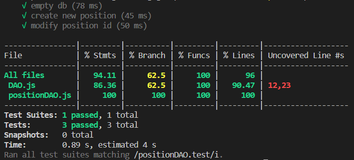
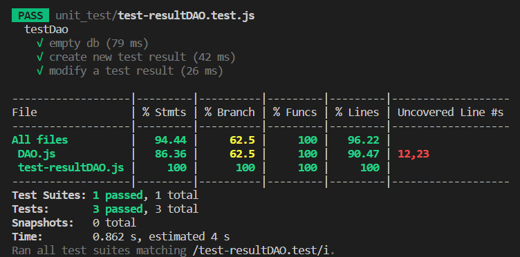
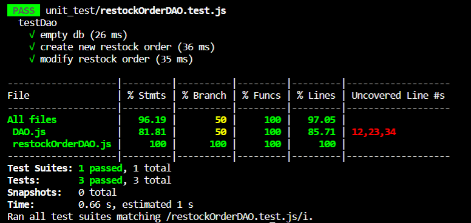
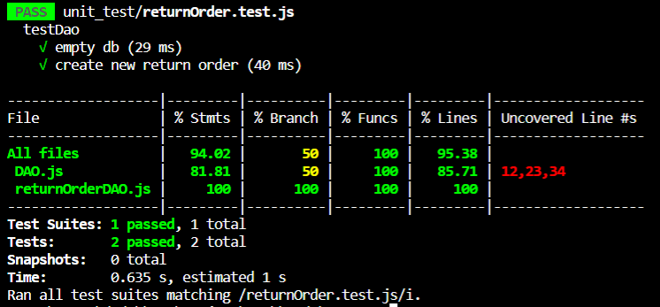
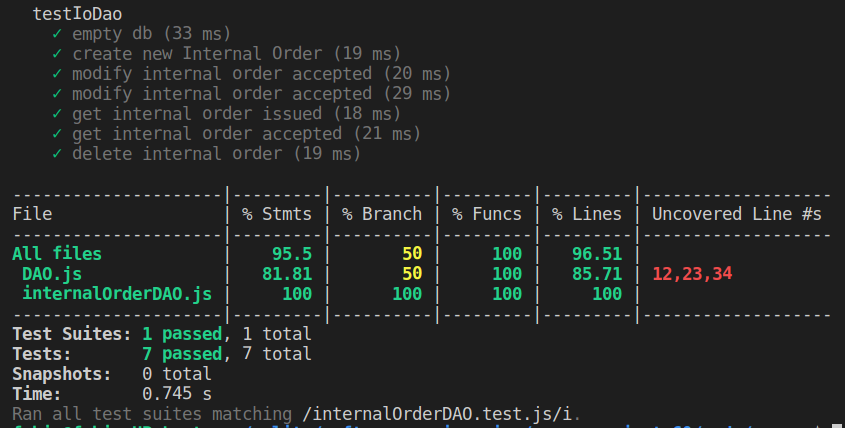

# Unit Testing Report

Date:

Version:

# Contents

- [Black Box Unit Tests](#black-box-unit-tests)

- [White Box Unit Tests](#white-box-unit-tests)

# Black Box Unit Tests

    <Define here criteria, predicates and the combination of predicates for each function of each class.
    Define test cases to cover all equivalence classes and boundary conditions.
    In the table, report the description of the black box test case and (traceability) the correspondence with the Jest test case writing the 
    class and method name that contains the test case>
    <Jest tests  must be in code/server/unit_test  >

    Since the units under test are dummy, i.e. all the logic is in the management classes, tests done on these classes are really simple.

### **Class *positionDAO* - method *createNewPositionWH***

**Criteria for method *createNewPositionWH*:**
	

 - ID already existing or not in DB

**Predicates for method *ncreateNewPositionWH*:**

| Criteria | Predicate              |
| -------- | ---------------------- |
| ID       | ID already exists      |
|          | ID does not exists yet |

**Combination of predicates**:

| ID         | Valid / Invalid | Description of the test case                                 | Jest test case      |
| ---------- | --------------- | ------------------------------------------------------------ | ------------------- |
| not exists | V               | try to insert a new position                                 | create new position |
| exists     | I               | try to insert a new position and than a new one with same id | create new position |

### **Class *test-descriptorDAO* - method *createTestDescriptor***

**Criteria for method *createTestDescriptor*:**
	

 - ID already existing or not in DB

**Predicates for method *createTestDescriptor*:**

| Criteria | Predicate              |
| -------- | ---------------------- |
| ID       | ID already exists      |
|          | ID does not exists yet |

**Combination of predicates**:

| ID         | Valid / Invalid | Description of the test case                                        | Jest test case             |
| ---------- | --------------- | ------------------------------------------------------------------- | -------------------------- |
| not exists | V               | try to insert a new test descriptor                                 | create new test descriptor |
| exists     | I               | try to insert a new test descriptor and than a new one with same id | create new test descriptor |

### **Class *test-resultDAO* - method *createTestResultByRfid***

**Criteria for method *createTestResultByRfid*:**
	

 - ID already existing or not in DB

**Predicates for method *createTestResultByRfid*:**

| Criteria | Predicate              |
| -------- | ---------------------- |
| ID       | ID already exists      |
|          | ID does not exists yet |

**Combination of predicates**:

| ID         | Valid / Invalid | Description of the test case                                    | Jest test case             |
| ---------- | --------------- | --------------------------------------------------------------- | -------------------------- |
| not exists | V               | try to insert a new test result                                 | create new test descriptor |
| exists     | I               | try to insert a new test result and than a new one with same id | create new test result     |

### **Class *restockOrderDAO* - method *storeRestockOrder***

**Criteria for method *storeRestockOrder*:**
	

 - ID already existing or not in DB

**Predicates for method *storeRestockOrder*:**

| Criteria | Predicate              |
| -------- | ---------------------- |
| ID       | ID already exists      |
|          | ID does not exists yet |

**Combination of predicates**:

| ID         | Valid / Invalid | Description of the test case                                      | Jest test case           |
| ---------- | --------------- | ----------------------------------------------------------------- | ------------------------ |
| not exists | V               | try to insert a new restock order                                 | create new restock order |
| exists     | I               | try to insert a new restock order and than a new one with same id | create new restock order |

### **Class *returnOrderDAO* - method *storeReturnOrder***

**Criteria for method *storeReturnOrder*:**
	

 - ID already existing or not in DB

**Predicates for method *storeReturnOrder*:**

| Criteria | Predicate              |
| -------- | ---------------------- |
| ID       | ID already exists      |
|          | ID does not exists yet |

**Combination of predicates**:

| ID         | Valid / Invalid | Description of the test case                                     | Jest test case          |
| ---------- | --------------- | ---------------------------------------------------------------- | ----------------------- |
| not exists | V               | try to insert a new return order                                 | create new return order |
| exists     | I               | try to insert a new return order and than a new one with same id | create new return order |

### **Class *skuDAO* -method *addSku***
**Criteria for method *addSku*:**
 - 1. All parameters are valid
 - 2. Sku is not in DB
  

**Predicates for method *addSku*:**
| Criteria | Predicate                    |
| -------- | ---------------------------- |
| 1        | All parameters are valid     |
|          | Some parameter are not valid |
| 2        | The SKU is not present in DB |

**Combination of predicates**:
| Criteria 1                | Criteria 2               | Valid / Invalid | Description of the test case                  | Jest test case                                                                                        |
| ------------------------- | ------------------------ | --------------- | --------------------------------------------- | ----------------------------------------------------------------------------------------------------- |
| All params are valid      | SKU is not present in DB | V               | A new SKU with valid params is added to DB    | Empty DB;    addNewSku(params);   sku = getSkuByID(skuID) --> if(params.body = sku.body) --> OK |  |
| Some params are not valid | SKU is not present in DB | I               | An error occurs with the validation of params | Empty DB;   addNewSku(params) --> error;                                                           |  |

### **Class *skuDAO* -method *setPosition***
**Criteria for method *setPosition*:**
- 1. Position exists
- 2. Position is valid
- 3. SKU exists 

**Predicates for method *setPosition*:**
| Criteria | Predicate                   |
| -------- | --------------------------- |
| 1        | The positionID is valid     |
|          | The positionID is not valid |
| 2        | The SKU exists in DB        |

**Combination of predicates**:
| Criteria 1                  | Criteria 2                | Valid / Invalid | Description of the test case                                    | Jest test case                                                                                                                                                     |
| --------------------------- | ------------------------- | --------------- | --------------------------------------------------------------- | ------------------------------------------------------------------------------------------------------------------------------------------------------------------ |
| the positionID is valid     | the SKU is  present in DB | V               | a new position is setted to the SKU                             | addNewSku(params);   setPosition(positionID, skuID   sku = getSkuByID(skuID)   if(params.body = sku.body) --> OK   sku.positionID == positionID --> OK |  |
| the positionID is not valid | the SKU is  present in DB | I               | an error occurs because of invalid positionID and invalid skuID | addNewSku(params);   setPosition(positionID,skuID) --> error                                                                                                    |  |

### **Class *skuDAO* -method *deleteSkuByID***
**Criteria for method *deleteSkyByID*:**
- 1. The sku exists  

**Predicates for method *deleteSkuByID*:**
| Criteria | Predicate              |
| -------- | ---------------------- |
| 1        | The skuID is valid     |
|          | The skuID is not valid |
| 2        | The sku exists         |

**Combination of predicates**:
| Criteria 1             | Criteria 2               | Valid / Invalid | Description of the test case             | Jest test case                                      |
| ---------------------- | ------------------------ | --------------- | ---------------------------------------- | --------------------------------------------------- |
| the skuID is valid     | the SKU is present in DB | V               | the sku is deleted                       | addNewSku(params);   deleteSkuByID(skuID) --> OK |  |
| the skuID is not valid | the SKU is present in DB | I               | an error occurs because of invalid skuID | addNewSku(params);   deleteSkuByID --> error     |  |
### **Class *skuDAO* -method *updateSkuByID***
**Criteria for method *updateSkuByID*:**
- 1. The sku exists (skuID is valid)  
- 2. The params are valid

**Predicates for method *updateSkuByID*:**
| Criteria | Predicate                  |
| -------- | -------------------------- |
| 1        | The skuID is valid         |
|          | The skuID is not valid     |
| 2        | The params are correct     |
|          | The params are not correct |

**Combination of predicates**:
| Criteria 1             | Criteria 2                 | Valid / Invalid | Description of the test case                                | Jest test case                                                                                 |
| ---------------------- | -------------------------- | --------------- | ----------------------------------------------------------- | ---------------------------------------------------------------------------------------------- |
| the skuID is valid     | the params are correct     | V               | the sku is updated                                          | addNewSku(params);   validateParams(params) == true then updateSkuByID(params, ID) --> OK   |  |
| the skuID is not valid | the params are correct     | I               | an error occurs because of invalid skuID                    | addNewSku(params);  validateParams(params) == true then updateSkuByID(params, ID) --> Error |  |
| the skuID is not valid | the params are not correct | I               | an error occurs because of invalid skuID and invalid params | addNewSku(params);  validateParams(params) == false --> error                               |  |
| the skuID is valid     | the params are not correct | I               | an error occurs because the params are not correct          | addNewSku(params);  validateParams(params) == false --> error                               |  |

### **Class *skuItemDAO* -method *storeSkuItem***
**Criteria for method *storeSkuItem*:**
- 1. The sku exists (skuID is valid)  
- 2. The params are valid

**Predicates for method *storeSkuItem*:**
| Criteria | Predicate                           |
| -------- | ----------------------------------- |
| 1        | The skuID is valid(sku exist in DB) |
|          | The skuID is not valid              |
| 2        | The params are correct              |
|          | The params are not correct          |

**Combination of predicates**:
| Criteria 1                                                                  | Criteria 2             | Valid / Invalid | Description of the test case                               | Jest test case                              |
| --------------------------------------------------------------------------- | ---------------------- | --------------- | ---------------------------------------------------------- | ------------------------------------------- |
| the skuID is valid                                                          | the params are correct | V               | the skuItem is stored                                      | addSku(data) then storeSkuItem(params)   |
| skuItem = getSkuItemByRFID(rfid);   if(skuItem.body = params.body) --> O |                        |
| The skuID is not valid                                                      | the params are correct | I               | the skuItem is not stored since there is no SKU associated |
 

| the skuID is valid | the params are not correct  | I | an error occurs because the params are not correct | validateParams(params) == false --> error||

### **Class *skuItemDAO* -method *editInfoSkuItem***
**Criteria for method *storeSkuItem*:**
- 1. The skuItem exists  
- 2. The params are valid

**Predicates for method *editInfoSkuItem*:**
| Criteria                   | Predicate                        |
| -------------------------- | -------------------------------- |
| 1                          | The skuItem is in DB(RFID valid) |
|                            | The skuItem is not in DB         |
| 2                          | The params are correct           |
| The params are not correct |

**Combination of predicates**:
| Criteria 1               | Criteria 2                 | Valid / Invalid | Description of the test case                                                                        | Jest test case                                                                                                                |
| ------------------------ | -------------------------- | --------------- | --------------------------------------------------------------------------------------------------- | ----------------------------------------------------------------------------------------------------------------------------- |
| the skuItem is in DB     | the params are correct     | V               | the skuItem is updated                                                                              | storeSkuItem(data)  skuItem = getSkuItemByRFID(rfid)  updateSkuItem(params, RFID)   if(skuItem.body = params) --> OK |  |
| the skuItem is in DB     | the params are not correct | I               | an error occurs because the params are not correct                                                  | storeSkuItem(data)  skuItem = getSkuItemByRFID(rfid)   updateSkuItem(params, RFID)--> error                             |  |
| the skuItem is not in DB | the params are not correct | I               | an error occurs because the params are not correct and the skuItem is not in DB(no RFID associated) | storeSkuItem(data)  skuItem = getSkuItemByRFID(rfid)  updateSkuItem(params, RFID) --> Error (no such Rfid)|  |
| the skuItem is not in DB | the params are  correct    | I               | an error occurs because there is no skuItem associated to RFID                                      |  storeSkuItem(data)  skuItem = getSkuItemByRFID(rfid)  updateSkuItem(params, RFID) --> Error (no such Rfid)|  |

### **Class *skuItemDAO* -method *getSkuItemBySkuID***
**Criteria for method *storeSkuItem*:**
- 1. The skuItem exists  
- 2. The SkuID is Valid

**Predicates for method *getSkuItemBySkuID*:**
| Criteria                 | Predicate            |
| ------------------------ | -------------------- |
| 1                        | The skuID is correct |
| The skuID is not correct |

**Combination of predicates**:
| Criteria 1             | Valid / Invalid | Description of the test case                                                               | Jest test case                   |
| ---------------------- | --------------- | ------------------------------------------------------------------------------------------ | -------------------------------- |
| The skuID is valid     | V               | The skuID is valid and from the get we obtain a list of skuItem where skuItem.skuID= skuID | storeSkuItem(data)  getSkuItemBySkuID(skuID)-->OK    |  |
| The skuID is not valid | i               | The skuID is not valid                                                                     |storeSkuItem(data)  getSkuItemBySkuID(skuID)-->error |  |

### **Class *itemDAO* - method *storeItem***

**Criteria for method *storeItem*:**
	

 - ID already existing or not in DB

**Predicates for method *createTestDescriptor*:**

| Criteria | Predicate              |
| -------- | ---------------------- |
| ID       | ID already exists      |
|          | ID does not exists yet |

**Combination of predicates**:

| ID         | Valid / Invalid | Description of the test case                                            | Jest test case              |
| ---------- | --------------- | ----------------------------------------------------------------------- | --------------------------- |
| not exists | V               | try to insert a new item                                                | create new item             |
| exists     | I               | try to insert a new item and than a new one with same id and supplierId | create new item - duplicate |

# White Box Unit Tests

### Test cases definition

| Unit name          | Jest test case                 |
| ------------------ | ------------------------------ |
| positionDAO        | empty db                       |
| positionDAO        | create new position            |
| positionDAO        | modify position id             |
| test-descriptorDAO | empty db                       |
| test-descriptorDAO | create new test descriptor     |
| test-descriptorDAO | Modify a test descriptor       |
| test-resultDAO     | empty db                       |
| test-resultDAO     | create new test result         |
| test-resultDAO     | modify a test result           |
| restockOrderDAO    | empty db                       |
| restockOrderDAO    | create new restock order       |
| restockOrderDAO    | modify restock order           |
| returnOrderDAO     | empty db                       |
| returnOrderDAO     | create new return order        |
| returnOrderDAO     | modify return order            |
| itemDAO            | create new item                |
| itemDAO            | create new item - duplicate    |
| itemDAO            | delete item                    |
| itemDAO            | modify item                    |
| itemDAO            | get sku by supp                |
| internalOrderDAO   | get internal order issued      |
| internalOrderDAO   | get internal order accepted    |
| internalOrderDAO   | modify internal order accepted |
| internalOrderDAO   | delete internal order          |
| internalOrderDAO   | create new Internal Order      |

### Code coverage report

Coverage for positionDAO :

Coverage for test-descriptorDAO :

Coverage for test-resultDAO :

Coverage for restockOrderDAO :

Coverage for returnOrderDAO :

Coverage for itemDAO :

Coverage for returnOrderDAO :

### Loop coverage analysis

    <Identify significant loops in the units and reports the test cases
    developed to cover zero, one or multiple iterations >

| Unit name | Loop rows | Number of iterations | Jest test case |
| --------- | --------- | -------------------- | -------------- |
|           |           |                      |                |
|           |           |                      |                |
|           |           |                      |                |  |

